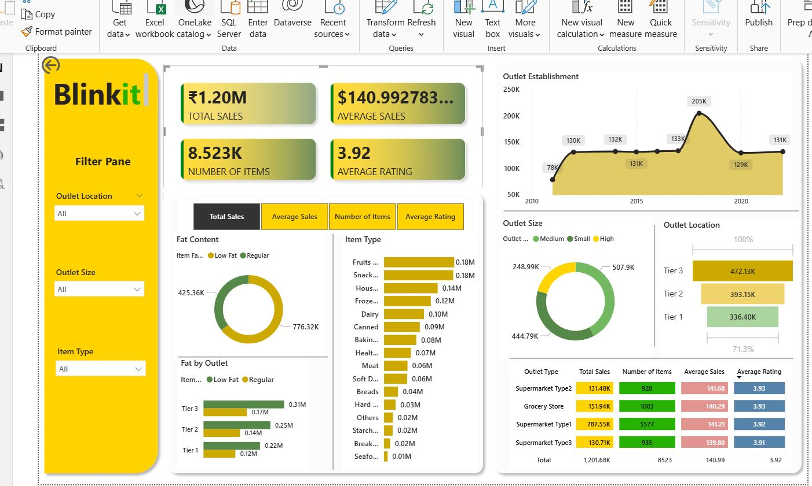

# 🛒 Blinkit Grocery Sales Analytics — Power BI Dashboard

> A full-scale Power BI business intelligence project analyzing **₹1.20M+ in grocery sales** across outlet types, locations, and product categories — built to surface operational and strategic insights for India's leading quick-commerce platform.

---

## 🖼️ Dashboard Preview



---

## 🎯 Project Overview

This project delivers a single-page, interactive **Power BI dashboard** modeled on Blinkit's grocery retail data. It enables decision-makers to slice and drill into performance across **outlet tiers, sizes, item categories, and fat content segments** — all from one unified view.

The dashboard answers critical business questions:

- Which outlet type and tier generates the most revenue?
- How has outlet establishment growth trended over the past decade?
- Which product categories and fat content types drive the most sales?
- Where do average ratings differ across outlet formats?

---

## 📊 Key KPIs at a Glance

| Metric | Value |
|---|---|
| 💰 Total Sales | ₹1.20M |
| 📦 Number of Items | 8,523 |
| 📈 Average Sales per Item | ₹140.99 |
| ⭐ Average Customer Rating | 3.92 / 5 |

---

## 🔍 Dashboard Breakdown

### 🥗 Fat Content Analysis
- **Regular items** contribute ₹776.32K vs. **Low Fat** at ₹425.36K — a 65/35 split
- Fat content is cross-filtered by outlet tier (Tier 1–3) via a stacked bar breakdown

### 🍎 Sales by Item Type (16 Categories)
Top-performing categories:

| Rank | Category | Sales |
|---|---|---|
| 1 | Fruits & Vegetables | ₹0.18M |
| 2 | Snack Foods | ₹0.18M |
| 3 | Household | ₹0.14M |
| 4 | Frozen Foods | ₹0.12M |
| 5 | Dairy | ₹0.10M |

### 🏪 Outlet Performance Matrix

| Outlet Type | Total Sales | Items | Avg Sales | Avg Rating |
|---|---|---|---|---|
| Supermarket Type1 | ₹787.55K | 5,577 | ₹141.21 | 3.92 |
| Grocery Store | ₹151.94K | 1,083 | ₹140.29 | 3.93 |
| Supermarket Type2 | ₹131.48K | 928 | ₹141.68 | 3.93 |
| Supermarket Type3 | ₹130.71K | 935 | ₹139.80 | 3.91 |

### 🏙️ Outlet Location — Tier Analysis
- **Tier 3** leads with **₹472.13K** in total sales (~39% of total)
- **Tier 2**: ₹393.15K &nbsp;|&nbsp; **Tier 1**: ₹336.40K
- Tier 3 dominance challenges the assumption that metro outlets outperform — strong signal for regional expansion strategy

### 📅 Outlet Establishment Timeline (2010–2022)
- Peak year: **2020 at 205K** — likely pandemic-driven expansion
- Consistent plateau at 130–133K (2013–2018) before the spike
- Post-2020 stabilization suggests a consolidation phase

### 🔘 Outlet Size Breakdown
- **Medium**: ₹507.9K (largest contributor)
- **Small**: ₹444.79K
- **High (Large)**: ₹248.99K

---

## 🗃️ Dataset Overview

**File:** `BlinkIT_Grocery_Data.xlsx` &nbsp;|&nbsp; **8,523 rows × 12 columns**

| Column | Type | Description |
|---|---|---|
| `Item Identifier` | String | Unique SKU code per product |
| `Item Type` | Categorical | 16 product categories (Fruits, Dairy, Snacks, etc.) |
| `Item Fat Content` | Categorical | Low Fat / Regular *(raw data had 5 inconsistent labels — cleaned in Power Query)* |
| `Item Visibility` | Float | Shelf visibility score (0–1) |
| `Item Weight` | Float | Product weight |
| `Outlet Identifier` | String | Unique outlet code |
| `Outlet Establishment Year` | Integer | Year outlet opened (2011–2022) |
| `Outlet Location Type` | Categorical | Tier 1 / Tier 2 / Tier 3 |
| `Outlet Size` | Categorical | Small / Medium / High |
| `Outlet Type` | Categorical | Grocery Store / Supermarket Type 1–3 |
| `Sales` | Float | Item-level revenue (₹) |
| `Rating` | Float | Customer satisfaction score (1–5) |

> ⚠️ **Data Quality Note:** Fat content labels had 5 raw variants (`Low Fat`, `low fat`, `LF`, `reg`, `Regular`). These were standardized to two canonical values in Power Query before any measures were built.

---

## 🛠️ Tools & Techniques

| Area | Details |
|---|---|
| **BI Tool** | Microsoft Power BI Desktop |
| **Data Preparation** | Power Query (M) — null handling, label normalization, type casting |
| **Data Modeling** | Single flat table + DAX calculated measures |
| **DAX Measures** | `SUMX`, `AVERAGEX`, `COUNTROWS`, `CALCULATE`, `SELECTEDVALUE` |
| **Visuals Used** | KPI cards, donut charts, horizontal bar charts, area chart, matrix table, slicers |
| **UX / Branding** | Blinkit brand palette (yellow `#F9C92A` / green `#4A7C59`), custom filter pane |
| **Interactivity** | Cross-filtering, dynamic metric toggle (4-button switcher) |

---

## ⚙️ Dynamic Metric Toggle

The dashboard features a **4-button metric switcher** that re-renders all visuals dynamically for:

| Button | Metric |
|---|---|
| `Total Sales` | Sum of all item revenue |
| `Average Sales` | Mean revenue per item |
| `Number of Items` | Count of distinct SKUs |
| `Average Rating` | Mean customer rating |

This eliminates the need for four separate report pages — one dashboard surface handles all four analytical lenses.

---

## 🚀 Getting Started

### Prerequisites
- Power BI Desktop (free) — [Download here](https://powerbi.microsoft.com/desktop)

### Steps

1. **Clone the repository**
   ```bash
   git clone https://github.com/your-username/blinkit-powerbi-dashboard.git
   cd blinkit-powerbi-dashboard
   ```

2. **Open the report**
   ```
   Double-click BlinkIT_Dashboard.pbix
   ```

3. **Refresh data** *(if source path changed)*
   - `Home → Transform Data → Data Source Settings`
   - Update the path to `BlinkIT_Grocery_Data.xlsx` on your machine
   - `Close & Apply → Refresh`

4. **Publish to Power BI Service** *(optional)*
   - Click `Publish` in the Home ribbon → select your workspace
   - 🔗 [View Live Report](#) *(add your published link here)*

---

## 📁 Repository Structure

```
📦 blinkit-powerbi-dashboard
├── 📊 BlinkIT_Dashboard.pbix          # Power BI report file
├── 📄 BlinkIT_Grocery_Data.xlsx       # Source dataset — 8,523 records × 12 columns
├── 🖼️ blinkit.JPG                     # Dashboard preview screenshot
└── 📝 README.md
```

---

## 💡 Key Business Insights

| # | Insight |
|---|---|
| 1 | **Tier 3 cities outperform Tier 1** in total sales — quick-commerce demand is strongest in emerging urban markets, not metros |
| 2 | **Supermarket Type1 holds 65% of total sales** (₹787K) and 65% of SKUs — the dominant format by a wide margin |
| 3 | **Low Fat items underperform** despite health trends — gap in Low Fat assortment depth or in-app visibility |
| 4 | **Fruits & Vegetables and Snack Foods are tied** at ₹0.18M each — impulse snack demand rivals fresh produce |
| 5 | **2020 was the peak outlet expansion year** (205K) — pandemic acceleration followed by post-2021 consolidation |
| 6 | **Ratings are almost identical** across all outlet types (3.91–3.93) — satisfaction is uniform; differentiation lives in speed and availability |
| 7 | **Medium outlets outperform High (Large) outlets** — store size alone doesn't predict revenue; assortment and location tier matter more |

---

## 🙋 About the Author

**[Gayatri Jangam]**  
Data Analyst | Power BI · SQL · Python · Tableau

- 📧 [your-email@example.com](mailto:gayatrijangam6@gmail.com)
- 💼 [LinkedIn](www.linkedin.com/in/gayatri-mallaya-jangam-offcial)
- 🐙 [GitHub](https://github.com/your-username)
- 📊 [Power BI Published Report](#)

---

> ⭐ Found this useful? Drop a star — it helps others discover the project!
